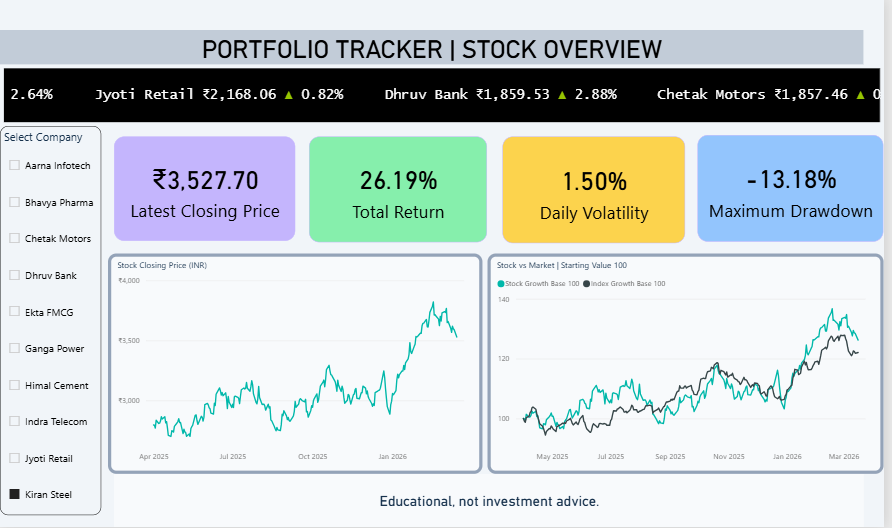
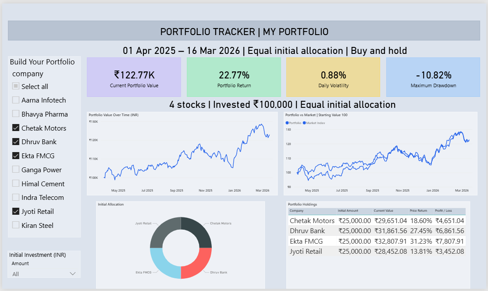
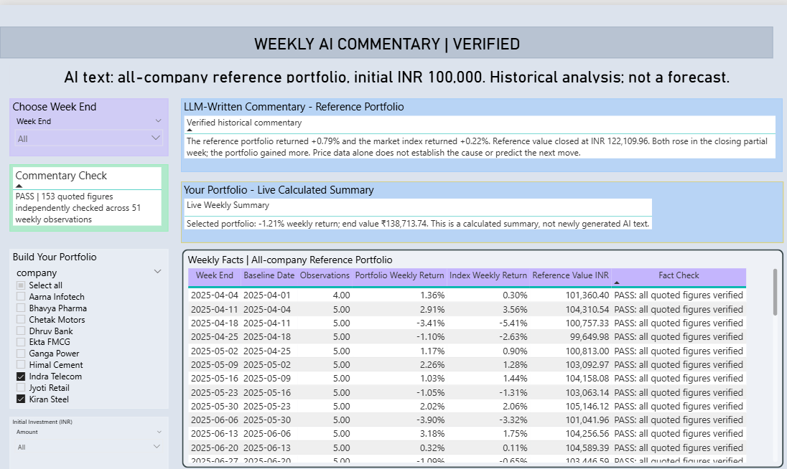

# Portfolio Tracker with AI Commentary

A Power BI project for exploring stock performance, building a portfolio and reviewing verified AI commentary.

---

## Stock Overview

The Stock Overview page allows users to select a company and examine its performance through four KPI cards: **latest closing price, total return, daily volatility and maximum drawdown**.

The stock ticker displays all 10 companies. The charts show the selected company's price trend and its growth compared with the market index, with both comparison series starting at 100.

---

## My Portfolio

The My Portfolio page allows users to **select companies and choose an initial investment amount**. The investment is divided equally between the selected companies and tracked using a buy-and-hold approach.

KPI cards display portfolio value, return, volatility and maximum drawdown. The charts show portfolio growth, market comparison and initial allocation, while the holdings table provides each company's current value and profit or loss.

---

## Weekly AI Commentary and Verification

This page displays **weekly AI commentary for the all-company reference portfolio**, alongside the financial figures used to verify it.

Users can select a week, review the commentary and inspect the fact-check table. The verification covers **153 quoted figures across 51 weekly observations**. A separate live calculated summary updates for the user's selected portfolio.

---

## Project Details

**Prepared by:** Dhruv Juneja  
**PRN:** 26030242017  
**Submitted to:** Yogesh Murumkar  
**Institute:** Symbiosis Centre for Information Technology (SCIT)

**Tools:** Power BI Desktop, Power Query, DAX, Microsoft Excel and ChatGPT.

The project uses only the dataset supplied with the assignment.

---

**Educational use only. Not investment advice or a forecast.**
